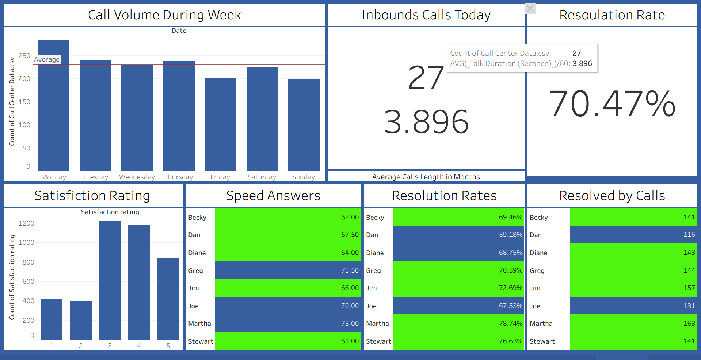

# Call-Center-Analytics- Using Tableau
# 📞 Call Center Performance Analysis Dashboard

## 📊 Project Overview
This project presents a comprehensive analysis of call center operations, focusing on agent efficiency, customer satisfaction, and volume trends. The dashboard provides actionable insights into service level agreements (SLAs) and individual agent performance.

---

## 🚀 Key Insights
* **Call Volume Trends:** Analysis of weekly patterns shows peak volume on **Mondays**, with a steady decline towards the weekend.
* **Customer Satisfaction:** Most calls fall into the **3 and 4-star rating** categories, indicating generally positive sentiment but room for improvement to reach 5-star service.
* **Agent Efficiency:** * **Martha** leads in resolution count (**163**) and has the highest resolution rate (**78.74%**).
    * **Greg** shows the highest average response speed (**75.50s**), suggesting a need for workflow optimization in that segment.

---

## 🛠️ Tools Used
* **Tableau:** For data visualization and dashboarding.
* **Excel/CSV:** For raw data management.
* **Markdown:** For project documentation.

---

## 📈 Featured Metrics
| Metric | Value | Description |
| :--- | :--- | :--- |
| **Total Resolution Rate** | 70.47% | Percentage of issues resolved on the first contact. |
| **Average Talk Duration** | 3.896 min | The mean time spent per inbound call. |
| **Peak Day** | Monday | The day with the highest call traffic. |

---

## 📬 Contact
Created by [Suhaj Ahmad] - feel free to reach out for collaboration!
[LinkedIn](https://www.linkedin.com/in/suhaj-ahmad-177b23a5/) 
